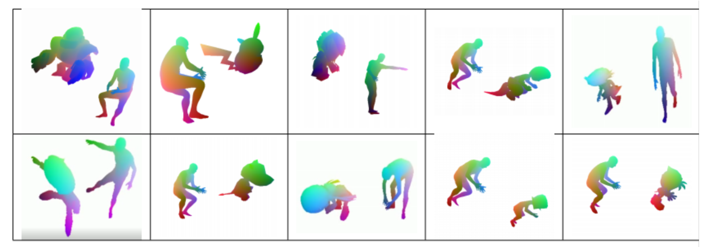
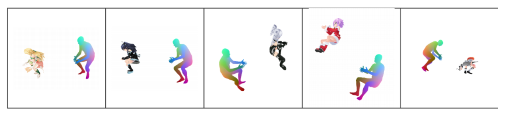

# Pose2Carton 

EE228 课程大作业 利用3D骨架控制3D卡通人物 (https://github.com/yuzhenbo/pose2carton) 

数据组别： Group21 (初始分配组别)

数据类型： fbx (10组匹配 + 5组蒙皮)

# Maya 环境配置

1.下载maya。
2.添加环境变量。
3.在mayapy中下载numpy等需要的库。
4.测试parser.py是否能正常使用。

# 匹配流程

1.（网络模型）使用parser.py对fbx进行分析。
2.更改transfer.py中路径到fbx文件对应的txt文件，打印骨骼关节名称编号。
3.根据编号写出对应的map。
4.运行transfer.py进行匹配。
5.运行vis.py进行可视化。
注：使用网络模型时py文件内需更改一bool值为真。

# 项目结果

# 协议 
本项目在 Apache-2.0 协议下开源

所涉及代码及数据的所有权以及最终解释权归倪冰冰老师课题组所有. 
